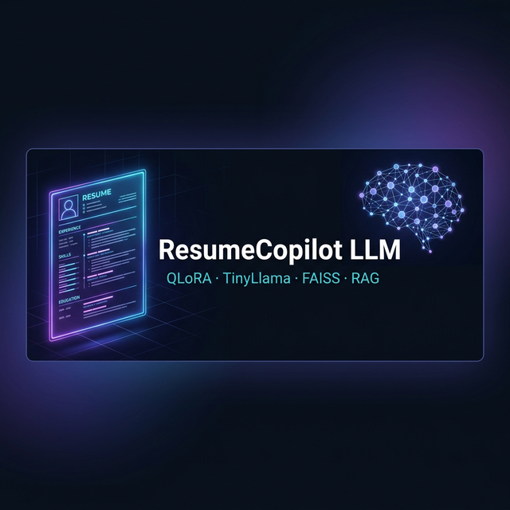

<div align="center">



# ResumeCopilot LLM

**QLoRA fine-tuned TinyLlama that analyses resumes, spots skill gaps,
suggests improvements, and generates interview questions — runs on Mac M2.**

[](https://python.org)
[](https://huggingface.co/TinyLlama/TinyLlama-1.1B-Chat-v1.0)
[](https://github.com/artidoro/qlora)
[](https://github.com/facebookresearch/faiss)
[](https://gradio.app)

</div>

---

## What It Does

| Capability | Description |
|---|---|
| Resume Analysis | Deep analysis of resume strengths and weaknesses |
| Skill Gap Detection | Identifies missing skills for your target role |
| Interview Questions | Generates tailored questions based on your resume |
| Resume Scoring | Scores your resume out of 10 with justification |
| RAG Job Matching | Retrieves real job descriptions to contextualise advice |
| PDF Parsing | Upload your resume as a PDF — no manual copy-paste |

---

## Architecture

```
Kaggle Dataset
      |
      v
preprocess_data.py  --->  3,000+ instruction examples
      |
      v
build_dataset.py    --->  Hugging Face DatasetDict (90/10 split)
      |
      v
train_qlora.py      --->  QLoRA fine-tuned TinyLlama-1.1B (MPS/CUDA/CPU)
      |
      |--> inference.py      (CLI + PDF parsing)
      |
      L--> app.py            (Gradio web demo)
                |
                L--> rag/retriever.py  (FAISS semantic search)
```

---

## Tech Stack

| Component | Technology |
|---|---|
| Base Model | TinyLlama-1.1B-Chat-v1.0 |
| Fine-tuning | QLoRA (PEFT + TRL 0.29+) |
| Dataset | Kaggle resume + job description CSVs |
| Embeddings | sentence-transformers/all-MiniLM-L6-v2 |
| Vector DB | FAISS (IndexFlatIP, cosine similarity) |
| Framework | HuggingFace Transformers 5.x + TRL |
| Demo UI | Gradio 6.x |
| Hardware | Apple M2 MPS (also CUDA / CPU) |

---

## Quick Start — New Device

The easiest way to get running on **any machine** from scratch:

```bash
git clone https://github.com/mustakim/resume-copilot-llm
cd resume-copilot-llm
chmod +x run.sh
./run.sh
```

That single command:
1. Creates a Python virtual environment (`llm_env/`)
2. Installs all dependencies from `requirements.txt`
3. Downloads Kaggle datasets (if credentials found) or uses 3,000 synthetic examples
4. Preprocesses and builds the instruction dataset
5. Fine-tunes TinyLlama with QLoRA (1 epoch / 500 samples by default)
6. Launches the Gradio demo at **http://localhost:7860**

### Run Script Options

```bash
./run.sh                   # Full pipeline (default: 1 epoch, 500 samples)
./run.sh --demo            # Skip training, launch demo with existing model
./run.sh --train           # Train only, no demo launch
./run.sh --full            # 3 epochs on 3000 samples (~2 hrs on M2)
./run.sh --epochs=2        # Custom epoch count
./run.sh --samples=1000    # Custom sample limit
./run.sh --skip-kaggle     # Synthetic data only (no Kaggle account needed)
./run.sh --help            # Show all options
```

---

## Manual Setup

### 1. Environment

```bash
python3 -m venv llm_env && source llm_env/bin/activate
pip install -r requirements.txt
```

### 2. Kaggle Data (Optional)

Place `kaggle.json` at `~/.kaggle/kaggle.json` from [Kaggle Settings](https://www.kaggle.com/settings).

```bash
python pipelines/kaggle_download.py
```

> **No Kaggle?** Skip this step. `preprocess_data.py` auto-generates 3,000 high-quality
> synthetic examples so training works out of the box.

### 3. Build Dataset

```bash
python pipelines/preprocess_data.py
python pipelines/build_dataset.py

# Optional: push dataset to HF Hub
python pipelines/build_dataset.py --push --hub-repo mustakim/resume-instruction-dataset
```

### 4. Fine-Tune with QLoRA

```bash
# Quick test — 18 min on M2
python training/train_qlora.py --epochs 1 --samples 500

# Full training — ~2 hrs on M2
python training/train_qlora.py --epochs 3

# Train + push to Hub
python training/train_qlora.py --epochs 3 --push --hub-repo mustakim/resume-copilot-llm
```

### 5. CLI Inference

```bash
python inference/inference.py --mode local         # local LoRA adapters
python inference/inference.py --mode base          # base TinyLlama
python inference/inference.py --mode local --pdf my_resume.pdf   # PDF upload
```

### 6. Gradio Demo

```bash
python app.py --mode local   # fine-tuned model
python app.py --mode base    # base model
# Open http://localhost:7860
```

---

## Training Results (Verified on Mac M2)

| Step | Loss | Token Accuracy | Epoch |
|---|---|---|---|
| Step 10 | 1.969 | 60.7% | 0.16 |
| Step 20 | 0.291 | 92.5% | 0.32 |
| Step 30 | 0.073 | 97.1% | 0.48 |
| **Step 63** | **0.061** | **97.1%** | **1.0** |

> **500 samples · 1 epoch · 18m 46s · Apple M2 MPS**
> Trainable params: 12.6M / 1.1B (1.13%)

---

## Project Structure

```
resume-copilot-llm/
├── run.sh                      One-command setup and launch
├── app.py                      Gradio web demo
├── requirements.txt
├── banner.png
|
├── pipelines/
|   ├── kaggle_download.py      Download Kaggle datasets
|   ├── preprocess_data.py      Build 3000+ instruction pairs
|   └── build_dataset.py        HF DatasetDict + optional Hub push
|
├── training/
|   ├── train_qlora.py          QLoRA fine-tuning (MPS/CUDA/CPU)
|   └── output/                 Saved LoRA adapters after training
|
├── rag/
|   ├── embeddings.py           all-MiniLM-L6-v2 embeddings
|   ├── vector_store.py         FAISS IndexFlatIP vector DB
|   └── retriever.py            RAG retriever + prompt builder
|
├── inference/
|   └── inference.py            CLI inference + PDF resume parser
|
└── data/
    ├── raw/                    Kaggle CSV files
    └── processed/
        ├── instructions.json   3000+ instruction pairs
        └── hf_dataset/         Saved HF DatasetDict
```

---

## Datasets

| Dataset | Source |
|---|---|
| Resume Dataset | [gauravduttakiit/resume-dataset](https://www.kaggle.com/datasets/gauravduttakiit/resume-dataset) |
| Job Skills Dataset | [PromptCloudHQ/skills-extracted-from-job-descriptions](https://www.kaggle.com/datasets/PromptCloudHQ/skills-extracted-from-job-descriptions) |

---

## Skills Demonstrated

| Area | Skills |
|---|---|
| LLM Fine-tuning | QLoRA, PEFT, LoRA adapters, SFTTrainer |
| Dataset Engineering | Instruction tuning format, HF datasets, train/test split |
| RAG | FAISS vector search, semantic embeddings, retrieval-augmented generation |
| MLOps | Model saving, Hub push, adapter merging |
| Apple Silicon | MPS acceleration, float16 on M2 |
| Demo UI | Gradio 6, custom CSS, PDF upload, RAG toggle |

---

<div align="center">
Made on a Mac M2 — because QLoRA should actually run on your laptop.
</div>